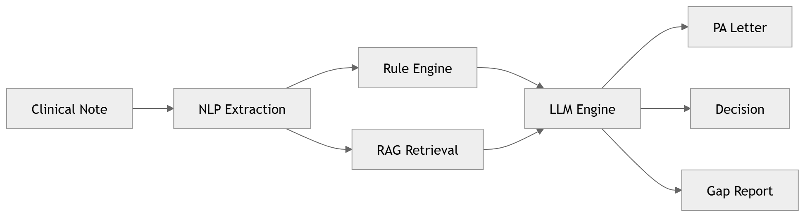

# Prior Authorization Automation
### Clinical NLP + LLM Pipeline for Healthcare Revenue Cycle
*by [Hannah Hiltz](https://www.linkedin.com/in/hannah-hiltz/) — Healthcare AI & Data Science*


End-to-end NLP + LLM pipeline that automates prior authorization decisions and generates justification letters — with a live interactive dashboard!

[Full Write-Up (GitPages)](https://github.com/Hannah-Hiltz/PriorAuthAutomation/blob/main/docs/index.md) | [Open End-to-End Pipeline in Colab](https://colab.research.google.com/github/Hannah-Hiltz/PriorAuthAutomation/blob/main/notebooks/00_full_pipeline_demo.ipynb) | [](https://hannah-hiltz.github.io/PriorAuthAutomation/) 

---

## Overview

Prior authorization (PA) is one of the most administratively burdensome processes in U.S. healthcare. Physicians spend an average of *16 hours per week* on PA paperwork, 94% report PA delays leading to care abandonment, and health systems lose an estimated *$528M annually* to write-offs and rework from denied or delayed authorizations.

This project builds an **end-to-end NLP and LLM pipeline** that processes unstructured physician clinical notes and generates:
- Prior authorization justification letters
- Decision classification (Approve / Deny / Pending Review)
- Documentation gap reporting

The pipeline is designed to serve both sides of the PA process: **providers** need faster, better-documented submissions; **payers** need consistent, structured clinical justifications that map cleanly to their criteria.

---

## Pipeline Architecture



This pipeline converts unstructured clinical notes into structured, policy-grounded prior authorization decisions using NLP extraction, rule-based validation, and LLM reasoning.

---

## Time Crunch? Run the Full Pipeline in One Click

This notebook runs the complete pipeline (NLP extraction → RAG → LLM → letter generation → evaluation) in a single notebook using the production `src/` modules. For convenience, the interactive dashboard is included, too! 

[Open End-to-End Pipeline in Colab](https://colab.research.google.com/github/Hannah_Hiltz/PriorAuthAutomation/blob/main/notebooks/00_full_pipeline_demo.ipynb) | [Open End-to-End Pipeline in Colab](https://colab.research.google.com/github/Hannah-Hiltz/PriorAuthAutomation/blob/main/notebooks/00_full_pipeline_demo.ipynb) | [](https://hannah-hiltz.github.io/PriorAuthAutomation/) 

If not using the end-to-end notebook, you will need to run the notebooks in order. Each notebook exports a data file used by the next. 

---

## Repository Structure

```
PriorAuthAutomation/
│
├── data/
│   ├── pa_synthetic_dataset.json       # 25 labeled synthetic PA cases
│   ├── ground_truth_labels.csv         # Decision labels for evaluation
│   └── payer_policies/
│       └── README.md                   # Which CMS LCDs to download
│
├── notebooks/
│   ├── 00_full_pipeline_demo.ipynb     # Full pipeline in one notebook
│   ├── 01_data_exploration.ipynb       # Dataset analysis and visualization
│   ├── 02_nlp_extraction.ipynb         # scispaCy entity extraction pipeline
│   ├── 03_rag_pipeline.ipynb           # Embedding, vector store, retrieval
│   ├── 04_prompt_engineering.ipynb     # LLM prompt development and testing
│   ├── 05_output_generation.ipynb      # Letter generation and formatting
│   └── 06_evaluation_roi.ipynb         # BERTScore, F1, ROI model
│
├── src/
│   ├── __init__.py
│   ├── extractor.py                    # scispaCy + regex NLP pipeline
│   ├── rule_engine.py                  # Step therapy and documentation scoring
│   ├── rag.py                          # Embedding + ChromaDB retrieval
│   ├── prompt_builder.py               # System/user prompt assembly + LLM calls
│   └── letter_generator.py             # PA letter and report formatting
│
├── prompts/
│   ├── pa_system_prompt_v1.txt         # General role + schema
│   └── pa_system_prompt_v2.txt         # Ordered decision criteria (improved)
│
├── evaluation/                         # Sample outputs reproducible by running notebooks
│   ├── classification_report.json
│   ├── bertscore_results.json
│   ├── decision_summary.csv
│   └── gap_report.csv
│
├── docs/                               # GitHub Pages site
│   └── index.html                      # Interactive pipeline dashboard (live demo)
│
├── pipeline_diagram.png                # Pipeline architecture diagram
├── .gitignore.txt
├── requirements.txt
└── README.md
```

---

## Dataset

* 25 fully synthetic prior authorization cases. **No real PHI used at any point.**
* Covers biologics, imaging, oncology, GLP-1 agonists, mental health, etc.
* PA letters are each labeled with:
  * Decision: 15 APPROVE / 7 DENY / 3 PENDING_REVIEW
  * Documentation quality: 16 strong / 7 weak / 2 partial

---

## Evaluation

* **BERTScore (F1)** → letter quality
* **Classification metrics**  → decision accuracy
* **Human review rate** → operational safety

## Key Results

| Metric | Value |
|---|---|
| BERTScore F1 (full letter) | 0.687 |
| BERTScore F1 (rationale only) | 0.757 |
| Auto-resolution rate | ~70% |
| Estimated annual value | $2M+ at 5,000 PA/month |
| Turnaround time | 3.5 days → 3 minutes |

BERTScore was evaluated two ways — full letter scoring (0.687) and rationale-section-only scoring (0.757). The gap reflects structural formatting differences between template-generated letters and free-form gold standard prose, not clinical content quality. See notebook 06 for full methodology.

---

## Tech Stack

| Component | Technology |
|---|---|
| Biomedical NLP | scispaCy, spaCy |
| LLM inference | Anthropic Claude, OpenAI GPT-4o |
| Embeddings | sentence-transformers (all-MiniLM-L6-v2) |
| Vector store | ChromaDB |
| Evaluation | bert-score, scikit-learn |
| Data | pandas, numpy |
| Environment | Google Colab / Jupyter |

---

## Getting Started

```bash
git clone https://github.com/Hannah-Hiltz/PriorAuthAutomation.git
cd PriorAuthAutomation

pip install scispacy spacy sentence-transformers chromadb
pip install anthropic openai bert-score pandas scikit-learn matplotlib seaborn
python -m spacy download en_core_web_sm

# Optional: set LLM API key (notebooks run in simulation mode without it)
export ANTHROPIC_API_KEY="your-key-here"
```

Then open `notebooks/00_end_to_end.ipynb` for the full pipeline, or start with `01_data_exploration.ipynb` to walk through each stage.

---

## Reproducibility

All outputs are generated by running the notebooks in order. No precomputed artifacts are required. The pipeline runs in full simulation mode without an API key — swap `LLM_PROVIDER = 'simulate'` to `'anthropic'` or `'openai'` in notebook 04 to use live inference.

---

## Scope & limitations

This repository reports results on 25 synthetic cases evaluated without a
held-out test set and without baseline comparisons. The headline numbers
(BERTScore F1 0.687 on full letters, 0.757 on the rationale section) should
be read as a working demonstration of the pipeline, not a validated
benchmark. The three items under **Roadmap** below address this directly.

## Roadmap

### 1. Expand the dataset to 250 stratified cases

The current n=25 distribution (15 APPROVE / 7 DENY / 3 PENDING_REVIEW) is
too small for stable Macro F1 on the minority classes. The expansion will
be stratified on `true_label`, `documentation_quality`, and
`clinical_category`. The synthetic-data generation protocol (model, prompt,
review pass) will be documented in `docs/` so readers can assess
provenance.

### 2. Introduce a train/test split

A seeded stratified split — 200 dev / 50 held-out test, stratified on
`true_label` × `documentation_quality` — with the test IDs committed to
`data/splits/test_ids.json`. Prompt engineering, few-shot example
selection, and RAG index construction will be restricted to the dev set,
so test-set results are not contaminated.

### 3. Publish a baseline comparison table

Every headline metric will be reported against three baselines in addition
to the full pipeline, so the contribution of the pipeline (not just the
underlying LLM) is measurable:

| System           | Accuracy | Macro F1 | BERTScore F1 (letter) | Gap Detection F1 |
|------------------|----------|----------|-----------------------|------------------|
| Majority class   | 60%      | 0.25     | 0.41                  | —                |
| LLM zero-shot    | ??       | ??       | ??                    | ??               |
| Rule engine only | ??       | ??       | —                     | ??               |
| Full pipeline    | ??       | ??       | 0.687                 | ??               |

Classification metrics will include 1000-sample bootstrap 95% confidence
intervals.

## Disclaimer

*This project uses entirely synthetic data. It is not intended for clinical use, does not constitute medical advice, and should not be deployed in a patient care setting without appropriate clinical validation, compliance review, and regulatory clearance.*

---

## About the Author
**Hannah Hiltz** - Healthcare AI and Data Science

I've worked in Emergency Rooms and Behavioral Health settings — and now I build the data systems that make those environments smarter for both clinicians and C-Suite executives. 

[LinkedIn](https://www.linkedin.com/in/hannah-hiltz/) | [GitHub](https://github.com/Hannah-Hiltz) | [Live Dashboard (PriorAuthAutomation)](https://hannah-hiltz.github.io/PriorAuthAutomation/)
